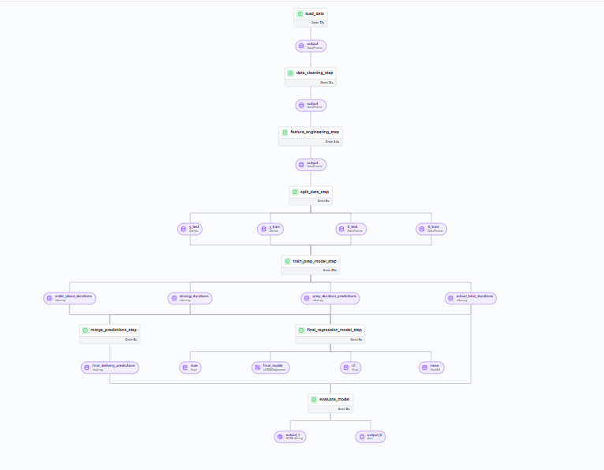
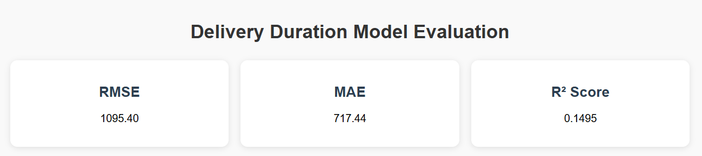

# Delivery Duration Prediction

   
    
   
  
<em>ZenML visualization of the training pipeline DAG</em>

   
    
   
  
<em>Metrics visualization</em>

## Data Overview

This project uses the [Delivery Duration Prediction dataset](https://platform.stratascratch.com/data-projects/delivery-duration-prediction) from Strata Scratch. The dataset contains:

- Time features (market_id, created_at, actual_delivery_time)
- Store features (store_id, store_primary_category, order_protocol)
- Order features (total_items, subtotal, num_distinct_items, min_item_price, max_item_price)
- Market features (total_onshift_dashers, total_busy_dashers, total_outstanding_orders)
- Predictions from other models (estimated_order_place_duration, estimated_store_to_consumer_driving_duration)

